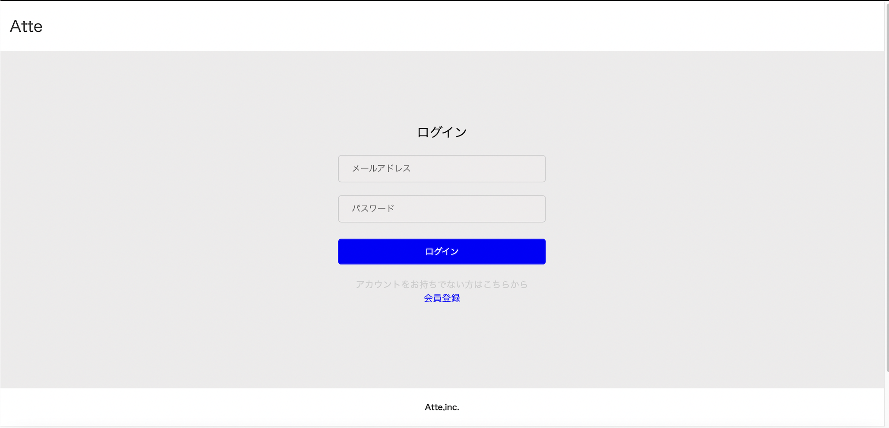
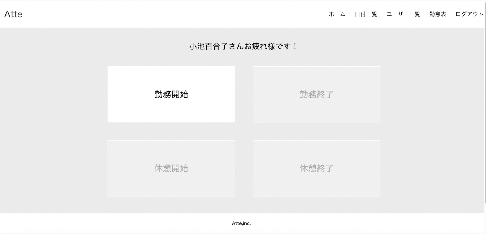
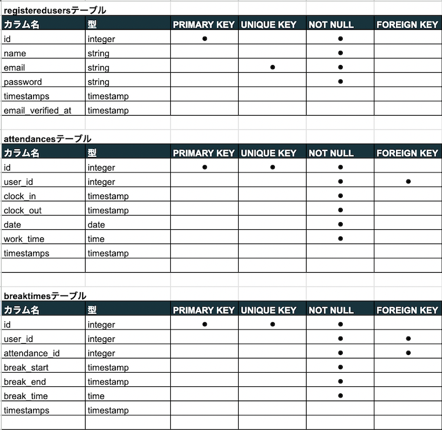
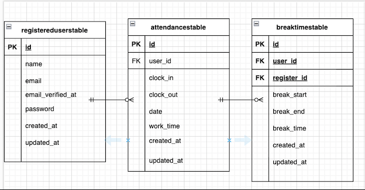

# 勤怠管理システム timetrack
氏名、メールアドレス、パスワードを入力し登録し、そのメールアドレスに届く確認メールを開き、 
メールアドレスとパスワードを入力しログインします。 
ログイン後、ボタン押下で勤務開始、勤務終了と休憩時間、終了時間を管理するアプリケーションです。 
 

## 作成した目的
ついつい押し忘れがちで面倒なタイムカードでの勤怠管理よりも、手軽に使用でき、個人情報もきちんと守られる 
管理できるアプリがあれば便利だと思い作成しました。

## アプリケーションURL
http://15.168.8.140/

## 機能一覧
  - メール認証

  - ログイン機能

  - 勤務状態をボタンで制御
  
  - 勤務時間、休憩時間管理
  
  - 日付別勤怠管理
  
  - ユーザー別勤怠管理

## 使用技術
　- Laravel Framework :Ver 8.83.27
　
  - PHP :Ver 8.3.9
　
  - mysql :Ver 8.3.0
　
  - HTML、CSS

## テーブル設計

## ER図

## 環境構築　
このプロジェクトをローカルで動作させるための手順です。
　1.リポジトリのクローン　https://github.com/Otsumu/timetrack.git 
　2.ディレクトリに移動　cd timetrack 
　3.依存関係のインストール　composer install 
　4.環境ファイルの作成　cp .env.example .env 
　5.データーベースの設定　nano .env 
　6.アプリケーションキーの生成　php artisan key.generate 
　7.データーベースのマイグレーション　php artisan migrate 
　8.アプリケーションの起動　php artisan serve 
　9.アプリケーションへのアクセル　http://localhost

